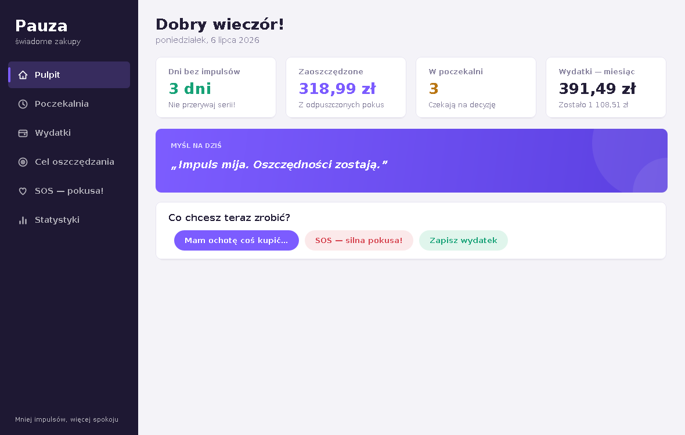
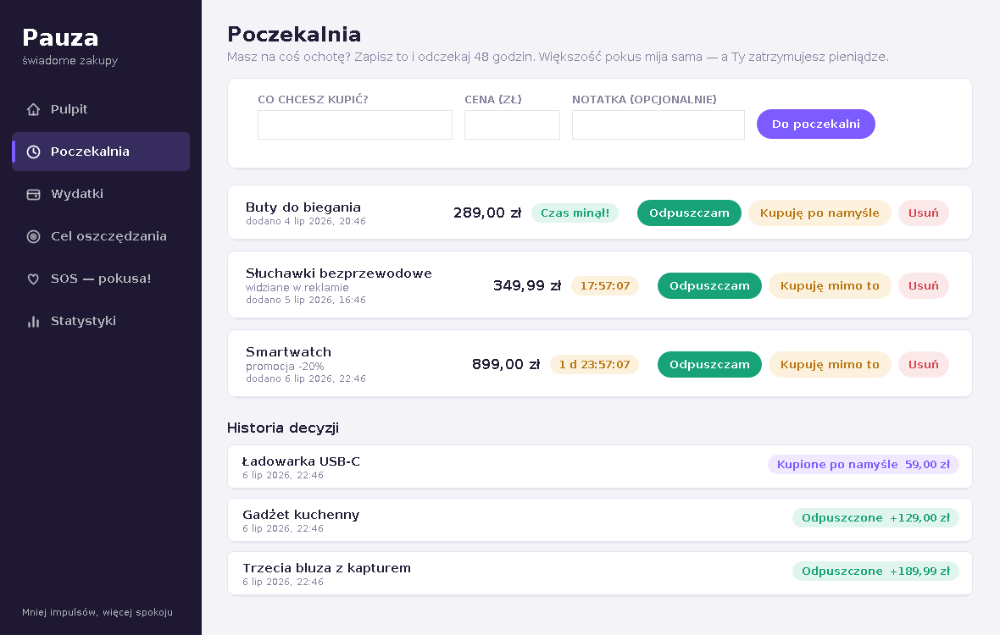
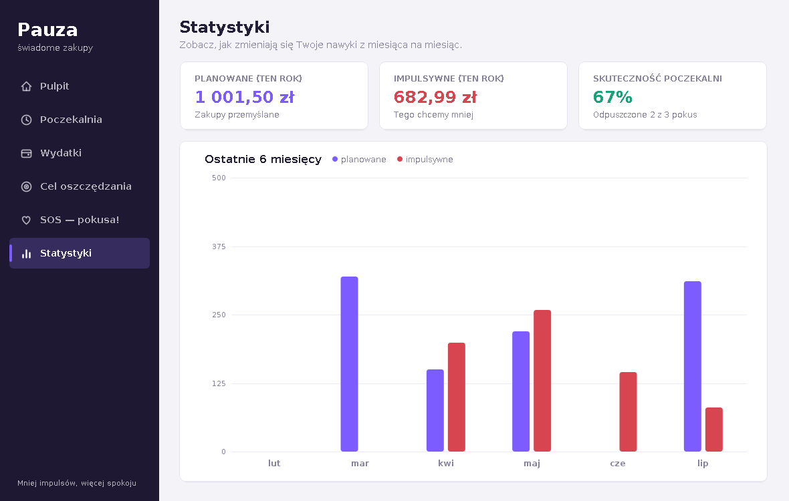

# Pauza — asystent świadomych zakupów

**Pauza** to desktopowa aplikacja w czystej Javie (Swing, zero zewnętrznych bibliotek) dla osób,
które chcą wyrwać się z zakupoholizmu. Pomaga zatrzymać się przed impulsywnym zakupem,
zobaczyć, ile pieniędzy udało się ocalić, i zamienić odpuszczone pokusy w realny cel.



## Funkcje

- **Pulpit** — seria dni bez zakupów impulsywnych, suma zaoszczędzonych pieniędzy,
  wydatki bieżącego miesiąca i motywująca myśl na dziś.
- **Poczekalnia (zasada 48 godzin)** — każdą pokusę zapisujesz z ceną, a aplikacja odlicza
  48 godzin. Po tym czasie decydujesz na chłodno: *odpuszczam* (kwota trafia do oszczędności)
  albo *kupuję po namyśle*. Zakup przed końcem odliczania jest uczciwie oznaczany jako
  impulsywny i zeruje Twoją serię.
- **Wydatki** — dziennik zakupów z kategoriami, oznaczaniem zakupów impulsywnych
  i miesięcznym budżetem z paskiem postępu.
- **Cel oszczędzania** — pierścień postępu pokazuje, jak pieniądze z odpuszczonych pokus
  przybliżają Cię do marzenia, plus lista Twoich „wygranych".
- **SOS** — na moment silnej pokusy: animowane ćwiczenie oddechowe 4·4·4
  i sześć pytań kontrolnych, które studzą impuls.
- **Statystyki** — wykres wydatków planowanych i impulsywnych z ostatnich 6 miesięcy
  oraz skuteczność poczekalni.




## Uruchomienie

Wymagana jest **Java 17 lub nowsza** (`java -version`).

**Linux / macOS:**

```bash
./run.sh
```

**Windows:** kliknij dwukrotnie `run.bat` (albo uruchom w terminalu).

Skrypt kompiluje źródła do katalogu `out/` i uruchamia aplikację. Ręcznie:

```bash
javac --release 17 -encoding UTF-8 -d out $(find src -name "*.java")
java -cp out pauza.Main
```

## Dane

Wszystko zapisuje się automatycznie w pliku tekstowym `~/.pauza/data.txt`
(w katalogu domowym). Usunięcie tego pliku zeruje aplikację.

## Test

Logikę danych (zapis, odczyt, budżet, odliczanie, oszczędności) można sprawdzić bez okna:

```bash
java -cp out pauza.Main --selftest
```

## Struktura kodu

| Plik | Rola |
|---|---|
| `src/pauza/Main.java` | punkt wejścia |
| `src/pauza/AppFrame.java` | główne okno i nawigacja |
| `src/pauza/DataStore.java` | model danych + trwały zapis |
| `src/pauza/Theme.java` | kolory, czcionki, formatowanie kwot |
| `src/pauza/Ui.java` | własne komponenty (karty, przyciski, wykresy pomocnicze) |
| `src/pauza/*Panel.java` | poszczególne ekrany |
| `src/pauza/SelfTest.java` | testy logiki uruchamiane flagą `--selftest` |
